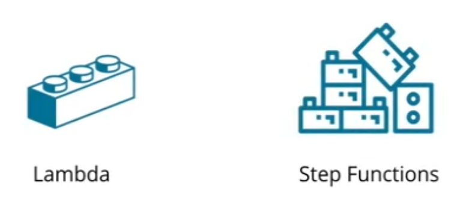
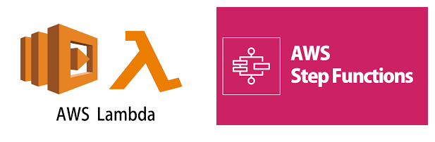
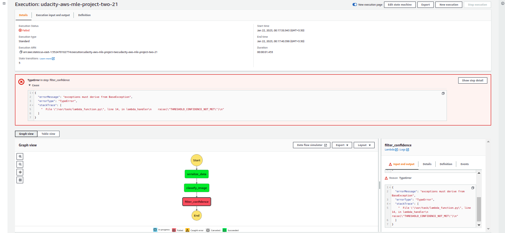
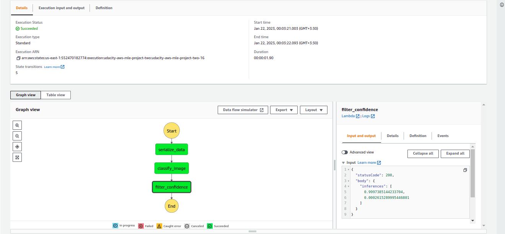
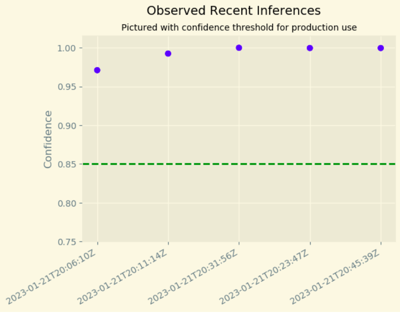
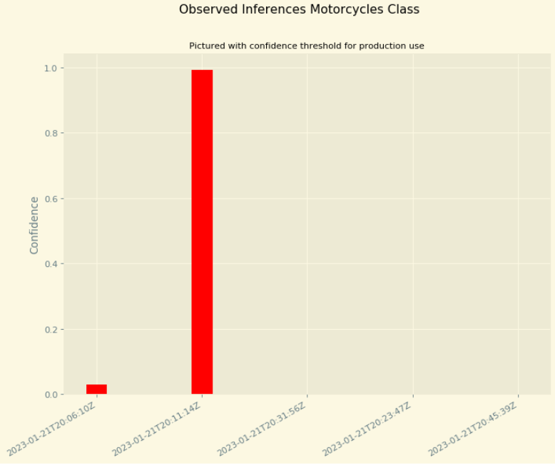
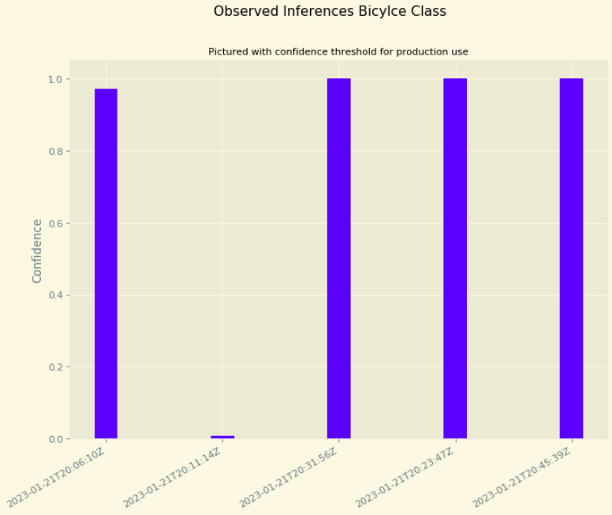

# Developing First ML Workflow
This is the Github repo for Udacity Developing your first ML workflow course. This repo contains the code for demos, exercises and the final project,
## Folder Structure
This repo contains a folder for each lesson and one project folder.

## Lessons Folder
Each lesson folder contains files for exercises and demos. The exercise code should contain instructions necessary for the exercises along with the solution. The demo code contains the files the instructor uses in the lesson demos.

## Project Folder
### Build an ML Workflow For Scones Unlimited On Amazon SageMaker
In this project, we'll be building an image classification model that can automatically detect which kind of vehicle delivery drivers have, in order to route them to the correct loading bay and orders. Assigning delivery professionals who have a bicycle to nearby orders and giving motorcyclists orders that are farther can help Scones Unlimited optimize their operations.

As an MLE, our goal is to ship a scalable and safe model. Once the model becomes available to other teams on-demand, it’s important that our model can scale to meet demand, and that safeguards are in place to monitor and control for drift or degraded performance.



We’ll use AWS Sagemaker to build an image classification model that can tell bicycles apart from motorcycles. We'll 
deploy our model, use AWS Lambda functions to build supporting services, and AWS Step Functions to compose our 
model and services into an event-driven application.




#### 1. Data Staging
We’ll use a sample dataset called CIFAR to simulate the challenges Scones Unlimited are facing in Image Classification. In order to start working with CIFAR we’ll need to:
1. Extract the data from a hosting service
2. Transform it into a usable shape and format
3. Load it into a production system

#### 2. Model training and Deployment
We will use an AWS build-in ```image classification``` algorithm to train the model. Once the model is successfully trained, we will deploy it to an endpoint and configure Model Monitor to track the deployment. At the end, we will make an inference to test the model endpoint.

#### 3. Lambdas and Step Function Workflow
We'll write and deploy three Lambda functions:

1. Save the code for each lambda function in a python script called [lambda.py](./project/lambda.py)
2. Take a screenshot of the working Step function

##### Workflow failure scenario 


##### Workflow success scenario


4. Export the step function as a [JSON file](./project/stepfunction.json)

#### 4. Testing and Evaluation


##### Confidence scores for recent inferences 


##### Confidence scores for ```Motorcycle``` class


##### Confidence scores for ```Bicycle``` class
